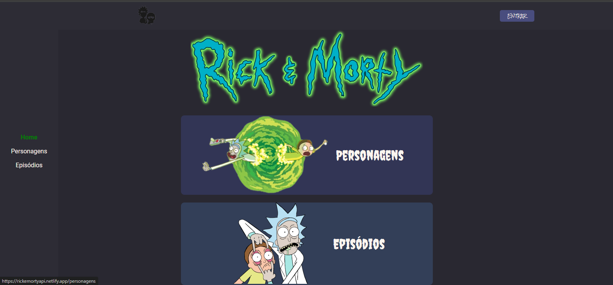

# Rick and Morty Api



## 📦 Instalação

Executar para clonar o projeto:

```bash
git clone https://github.com/Alencar-Bianca/rickandmorty.git
```

Entrar na pasta usando cd e executar para instalar as dependências necessárias:

```bash
npm install
```
Executar para rodar o projeto:

```bash
ng s 
```

## 🚀 Tecnologias

Esse projeto está sendo desenvolvido com as seguintes tecnologias:

- Angular
- HTML
- SCSS

## 🚧 Projeto:

Link do Projeto: [Rick and Morty Api](https://rickemortyapi.netlify.app/)
